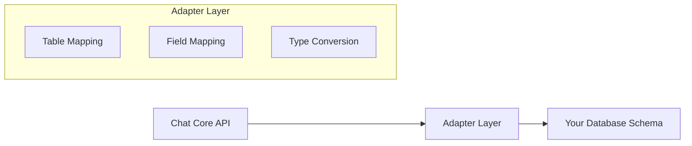

# Database Adapters

Chat Core uses a **database adapter pattern** to integrate with any existing database without requiring schema changes. This approach provides maximum flexibility while maintaining type safety and consistent APIs.

## Why Use Adapters?

### The Problem

Most chat libraries force you to:

- Create new database tables with specific names and schemas
- Migrate existing data to match their requirements
- Learn new database patterns and conventions
- Lock into a specific ORM or database solution

### The Solution

Chat Core adapters solve this by:

- **Working with your existing schema** - Map any table/column names
- **Supporting any database** - PostgreSQL, MySQL, SQLite through consistent APIs
- **Maintaining relationships** - Keep your existing foreign keys and indexes
- **Providing type safety** - Full TypeScript support with your schema
- **Enabling gradual adoption** - Start using Chat Core without changing existing code

## How Adapters Work

Adapters act as a translation layer between Chat Core's standardized API and your specific database schema:



### Table Mapping

Chat Core needs three core models, but you can map them to any existing tables:

```typescript
const adapter = createChatCoreAdapter(db, 'pg', {
  tables: {
    user: 'customers', // Map 'user' to your 'customers' table
    thread: 'support_tickets', // Map 'thread' to your 'support_tickets' table
    feedback: 'reviews', // Map 'feedback' to your 'reviews' table
  },
});
```

### Field Mapping

Map Chat Core's expected fields to your column names:

```typescript
const adapter = createChatCoreAdapter(db, 'pg', {
  tables: { user: 'customers', thread: 'tickets', feedback: 'reviews' },
  fields: {
    user: {
      id: 'customer_id', // Chat Core 'id' → your 'customer_id'
      name: 'full_name', // Chat Core 'name' → your 'full_name'
      createdAt: 'created_at', // Chat Core 'createdAt' → your 'created_at'
    },
  },
});
```

## Required Fields

Each model requires specific fields to function:

### User Model

- `id` - Primary key (string/UUID)
- `name` - Display name (string)
- `createdAt` - Creation timestamp
- `updatedAt` - Last update timestamp

### Thread Model

- `id` - Primary key (string/UUID)
- `userId` - Foreign key to user
- `createdAt` - Creation timestamp
- `updatedAt` - Last update timestamp
- `title` - Optional thread title
- `metadata` - Optional JSON metadata

### Feedback Model

- `id` - Primary key (string/UUID)
- `threadId` - Foreign key to thread
- `userId` - Foreign key to user
- `type` - Feedback category (string)
- `createdAt` - Creation timestamp
- `updatedAt` - Last update timestamp
- Optional: `rating`, `comment`, `helpful`, etc.

## Validation

Adapters validate your schema at startup to ensure all required fields exist:

```typescript
// This will throw a clear error if required fields are missing
const adapter = createChatCoreAdapter(db, 'pg', {
  tables: { user: 'customers', thread: 'tickets', feedback: 'reviews' },
  fields: {
    user: { name: 'nonexistent_field' }, // Error!
  },
});

// Error: Required field "nonexistent_field" not found in table "customers"
```

## Available Adapters

### Drizzle Adapter

Works with any Drizzle ORM database:

- **Supports**: PostgreSQL, MySQL, SQLite
- **Features**: Full schema introspection, automatic type conversion
- **Status**: ✅ Available

[Learn more about the Drizzle Adapter](./drizzle)

### Coming Soon

- **Prisma Adapter** - For Prisma ORM users
- **Raw SQL Adapter** - For direct database connections
- **TypeORM Adapter** - For TypeORM users

## Benefits

1. **No Database Changes** - Use your existing schema as-is
2. **Any Table Names** - `customers`, `users`, `accounts` all work
3. **Any Column Names** - Map `customer_id` to Chat Core's `id` field
4. **Existing Relationships** - Your foreign keys and indexes remain
5. **Database Agnostic** - Same API works across different databases
6. **Type Safe** - Full TypeScript support with your existing schema types
7. **Validation at Startup** - Clear errors if required fields are missing
8. **Future-Proof** - Easy to add other ORMs later

## Example: E-commerce Integration

```typescript
// Your existing e-commerce schema
export const customers = pgTable('customers', {
  customer_id: uuid('customer_id').primaryKey(),
  full_name: varchar('full_name', { length: 255 }),
  created_at: timestamp('created_at').defaultNow(),
  updated_at: timestamp('updated_at').defaultNow(),
});

export const support_tickets = pgTable('support_tickets', {
  ticket_id: uuid('ticket_id').primaryKey(),
  customer_id: uuid('customer_id').references(() => customers.customer_id),
  subject: varchar('subject', { length: 255 }),
  created_at: timestamp('created_at').defaultNow(),
  updated_at: timestamp('updated_at').defaultNow(),
});

// Chat Core adapter - no schema changes needed!
const adapter = createChatCoreAdapter(db, 'pg', {
  tables: {
    user: 'customers',
    thread: 'support_tickets',
    feedback: 'customer_feedback',
  },
  fields: {
    user: {
      id: 'customer_id',
      name: 'full_name',
      createdAt: 'created_at',
      updatedAt: 'updated_at',
    },
    thread: {
      id: 'ticket_id',
      title: 'subject',
      userId: 'customer_id',
      createdAt: 'created_at',
      updatedAt: 'updated_at',
    },
  },
});

// Now use Chat Core with your existing data!
const user = await adapter.findOne({
  model: 'user',
  where: [{ field: 'id', value: 'customer-123' }],
});
```

This approach lets you add Chat Core functionality to existing applications without disrupting your current database structure or requiring data migrations.
