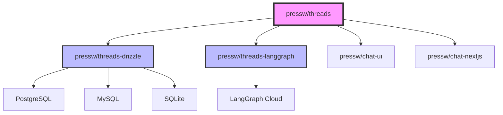

# TypeScript Packages Overview

The PressW AI Dev Tooling monorepo provides a suite of TypeScript packages for building AI-powered applications with thread management capabilities. These packages are designed to work together seamlessly while maintaining clear separation of concerns.

## Package Architecture



## Core Packages

### 🎯 [@pressw/threads](./threads/index.md)

The foundation package providing core thread management functionality without any database dependencies. It includes:

- Thread management interfaces and types
- Base adapter pattern for database integrations
- React hooks for thread operations
- TypeScript-first API with full type safety

### 🗄️ [@pressw/threads-drizzle](./threads-drizzle/index.md)

Database adapter for [Drizzle ORM](https://orm.drizzle.team/), supporting:

- PostgreSQL, MySQL, and SQLite
- Automatic schema generation
- Field mapping for existing databases
- Type-safe database operations

### ☁️ [@pressw/threads-langgraph](./threads-langgraph/index.md)

Cloud adapter for [LangGraph Cloud](https://langchain-ai.github.io/langgraph/cloud/), providing:

- Managed thread storage
- Built-in scalability
- Assistant integration
- Cloud-native thread management

### 💬 [@pressw/chat-ui](./chat-ui/index.md)

React components for chat interfaces:

- Pre-built chat components
- Customizable styling
- Message handling
- Thread visualization

### 🚀 [@pressw/chat-nextjs](./chat-nextjs/index.md)

Next.js integration utilities:

- Server-side thread management
- API route handlers
- Authentication helpers
- Server component support

## Quick Start

### Installation

Choose the packages you need for your project:

```bash
# Core thread management
npm install @pressw/threads

# Database adapter (choose one)
npm install @pressw/threads-drizzle drizzle-orm
# OR
npm install @pressw/threads-langgraph @langchain/langgraph-sdk

# UI components (optional)
npm install @pressw/chat-ui

# Next.js integration (optional)
npm install @pressw/chat-nextjs
```

### Basic Setup

```typescript
// 1. Choose your adapter
import { DrizzleAdapter } from '@pressw/threads-drizzle';
// OR
import { LangGraphAdapter } from '@pressw/threads-langgraph';

// 2. Create thread client
import { createThreadUtilityClient } from '@pressw/threads';

const threadClient = createThreadUtilityClient({
  adapter: new DrizzleAdapter(db, config),
  getUserContext: async (request) => ({
    userId: 'user-123',
    organizationId: 'org-456',
  }),
});

// 3. Use in your application
const thread = await threadClient.createThread(request, {
  title: 'Support Chat',
  metadata: { priority: 'high' },
});
```

## Package Selection Guide

| Use Case                                         | Recommended Packages                            |
| ------------------------------------------------ | ----------------------------------------------- |
| **Simple thread storage with existing database** | `@pressw/threads` + `@pressw/threads-drizzle`   |
| **Cloud-based AI assistant**                     | `@pressw/threads` + `@pressw/threads-langgraph` |
| **Next.js chat application**                     | All packages                                    |
| **Custom database integration**                  | `@pressw/threads` + custom adapter              |

## Architecture Principles

### 1. **Separation of Concerns**

Each package has a single, well-defined responsibility. The core package defines interfaces while adapters handle implementation details.

### 2. **Dependency Inversion**

Adapters depend on the core package, not vice versa. This allows for flexible database backends without changing core functionality.

### 3. **Type Safety**

All packages are written in TypeScript with comprehensive type definitions, ensuring compile-time safety and excellent IDE support.

### 4. **Framework Agnostic Core**

The core thread management functionality works with any JavaScript framework, while specific integrations are provided as separate packages.

## Migration Guides

- [Migrating from monolithic to adapter pattern](./threads/guides/migration.md)
- [Switching database adapters](./threads-drizzle/guides/switching-adapters.md)
- [Moving to LangGraph Cloud](./threads-langgraph/guides/migration.md)

## Next Steps

- Explore the [core thread management concepts](./threads/index.md)
- Choose and configure your [database adapter](./threads-drizzle/index.md)
- Build your UI with [chat components](./chat-ui/index.md)
- Deploy with [Next.js integration](./chat-nextjs/index.md)
