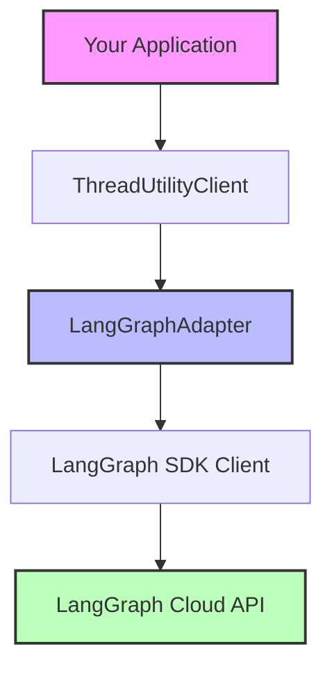

# Threads LangGraph Adapter

The `@pressw/threads-langgraph` package provides a seamless adapter for integrating LangGraph Cloud's thread management system with the PressW Threads SDK. This adapter enables you to leverage LangGraph Cloud's powerful conversational AI infrastructure while maintaining compatibility with the standard PressW thread management interface.

## Overview

LangGraph Cloud is a deployment platform for LangGraph applications that provides persistent thread management, state tracking, and conversational history. This adapter bridges the gap between LangGraph's cloud infrastructure and PressW's thread management patterns.

### Key Features

- **Full Compatibility**: Implements the complete `ChatCoreAdapter` interface from `@pressw/threads`
- **Thread Persistence**: Automatic thread state persistence in LangGraph Cloud
- **Metadata Support**: Rich metadata attachment for thread organization and filtering
- **Access Control**: Built-in support for multi-tenant access control
- **Type Safety**: Full TypeScript support with comprehensive type definitions
- **Streaming Support**: Compatible with LangGraph's real-time streaming capabilities

## Installation

```bash
npm install @pressw/threads-langgraph @pressw/threads
# or
yarn add @pressw/threads-langgraph @pressw/threads
# or
bun add @pressw/threads-langgraph @pressw/threads
```

### Prerequisites

- Node.js 18 or higher
- A LangGraph Cloud deployment or local LangGraph server
- LangSmith API key for authentication

## Quick Start

Here's a minimal example to get you started:

```typescript
import { createLangGraphAdapter } from '@pressw/threads-langgraph';
import { ThreadUtilityClient } from '@pressw/threads';

// Create the adapter
const adapter = createLangGraphAdapter({
  apiUrl: process.env.LANGGRAPH_API_URL!,
  apiKey: process.env.LANGSMITH_API_KEY!,
});

// Initialize the thread client
const threadClient = new ThreadUtilityClient(adapter, async (request) => ({
  userId: 'user-123',
  organizationId: 'org-456',
}));

// Create a thread
const thread = await threadClient.createThread(request, {
  title: 'Customer Support Chat',
  metadata: { priority: 'high' },
});
```

## Architecture

The LangGraph adapter follows a layered architecture:



### Adapter Pattern

The adapter implements the standard `ChatCoreAdapter` interface, providing these core operations:

- **create**: Create new threads with metadata
- **findOne**: Retrieve a specific thread by ID
- **findMany**: Search and list threads with filtering
- **update**: Update thread metadata and properties
- **delete**: Remove threads with access control
- **count**: Get the number of threads matching criteria

## Use Cases

### 1. Customer Support Systems

Build sophisticated support chat systems with conversation history and context persistence:

```typescript
const supportThread = await threadClient.createThread(request, {
  title: 'Technical Support Request',
  metadata: {
    category: 'billing',
    priority: 'urgent',
    customerId: 'cust-789',
  },
});
```

### 2. AI Assistant Applications

Create persistent AI assistant conversations that maintain context across sessions:

```typescript
const assistantThread = await threadClient.createThread(request, {
  title: 'Code Review Assistant',
  metadata: {
    projectId: 'proj-123',
    language: 'typescript',
    framework: 'react',
  },
});
```

### 3. Multi-tenant SaaS Applications

Leverage built-in tenant isolation for secure, multi-tenant applications:

```typescript
const tenantThread = await threadClient.createThread(request, {
  title: 'Team Collaboration',
  metadata: {
    teamId: 'team-456',
    workspace: 'engineering',
  },
});
```

## Integration with LangGraph Features

While this adapter focuses on thread management, it's designed to work seamlessly with LangGraph's broader ecosystem:

### Running Assistants

After creating threads with this adapter, you can run LangGraph assistants:

```typescript
// Create thread with adapter
const thread = await threadClient.createThread(request, {
  title: 'AI Assistant Chat',
});

// Use LangGraph SDK directly for runs
const client = new Client({ apiUrl, apiKey });
const stream = client.runs.stream(
  thread.id,
  'assistant-id',
  { input: { messages: [...] } }
);
```

### Thread State Management

Access thread state and history using the adapter's thread IDs:

```typescript
// Get thread with adapter
const thread = await threadClient.getThread(request, threadId);

// Access state with LangGraph SDK
const state = await client.threads.getState(thread.id);
const history = await client.threads.getHistory(thread.id);
```

## Configuration

The adapter supports extensive configuration options:

```typescript
const adapter = createLangGraphAdapter({
  // Required
  apiUrl: 'https://your-deployment.langchain.com',
  apiKey: 'lsv2_pt_...',

  // Optional
  assistantId: 'my-assistant',
  defaultHeaders: {
    'X-Custom-Header': 'value',
  },

  // Adapter behavior
  usePlural: false,
  debugLogs: true,
  generateId: () => customIdGenerator(),
});
```

## Best Practices

### 1. Environment Configuration

Store sensitive configuration in environment variables:

```bash
# .env
LANGGRAPH_API_URL=https://your-deployment.langchain.com
LANGSMITH_API_KEY=lsv2_pt_your_key_here
```

### 2. Error Handling

Always wrap adapter operations in try-catch blocks:

```typescript
try {
  const thread = await threadClient.createThread(request, data);
} catch (error) {
  if (error.message.includes('not found')) {
    // Handle not found errors
  } else {
    // Handle other errors
  }
}
```

### 3. Metadata Design

Design your metadata schema for efficient filtering:

```typescript
interface ThreadMetadata {
  // Searchable fields
  userId: string;
  status: 'active' | 'resolved' | 'archived';

  // Descriptive fields
  tags: string[];
  context: Record<string, any>;
}
```

## Next Steps

- Explore the [API Reference](./api) for detailed method documentation
- Check out [Usage Examples](./examples) for common patterns
- Read the [Integration Guide](./guides/integration) for advanced use cases
- Learn about [Migration](./guides/migration) from other thread systems

## Support

For issues and questions:

- [GitHub Issues](https://github.com/pressw/ai-dev-tooling/issues)
- [API Documentation](./api)
- [LangGraph Cloud Docs](https://langchain-ai.github.io/langgraph/cloud/)
