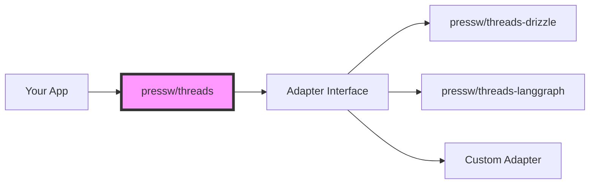

# @pressw/threads

Core thread management package providing the foundation for building conversational AI applications. This package defines the interfaces and base implementations used by all adapters.

## Overview

`@pressw/threads` is a **database-agnostic** thread management system that provides:

- 🎯 **Core Interfaces**: Thread, User, and Feedback types
- 🔌 **Adapter Pattern**: Pluggable database backends
- ⚛️ **React Hooks**: Thread management hooks for React applications
- 🔐 **Multi-tenancy**: Built-in support for user/organization/tenant isolation
- 📝 **TypeScript First**: Full type safety and IntelliSense support

## Architecture



## Installation

```bash
npm install @pressw/threads

# You'll also need an adapter
npm install @pressw/threads-drizzle
# OR
npm install @pressw/threads-langgraph
```

## Core Concepts

### Thread Model

A thread represents a conversation or interaction session:

```typescript
interface Thread {
  id: string;
  title?: string;
  userId: string;
  organizationId?: string;
  tenantId?: string;
  metadata?: Record<string, unknown>;
  createdAt: Date;
  updatedAt: Date;
}
```

### User Context

Every operation requires user context for proper isolation:

```typescript
interface UserContext {
  userId: string;
  organizationId?: string | null;
  tenantId?: string | null;
}
```

### Adapter Pattern

The package uses an adapter pattern to support different storage backends:

```typescript
interface ChatCoreAdapter {
  create<T>(params: CreateParams): Promise<T>;
  findOne<T>(params: FindParams): Promise<T | null>;
  findMany<T>(params: FindManyParams): Promise<T[]>;
  update<T>(params: UpdateParams): Promise<T | null>;
  delete(params: DeleteParams): Promise<void>;
  count(params: CountParams): Promise<number>;
}
```

## Basic Usage

### 1. Choose Your Adapter

```typescript
// For SQL databases with Drizzle ORM
import { DrizzleAdapter } from '@pressw/threads-drizzle';
import { drizzle } from 'drizzle-orm/postgres-js';

const db = drizzle(connection);
const adapter = new DrizzleAdapter(db, {
  provider: 'postgres',
  tables: {
    user: 'users',
    thread: 'threads',
    feedback: 'feedback',
  },
});

// OR for LangGraph Cloud
import { LangGraphAdapter } from '@pressw/threads-langgraph';

const adapter = new LangGraphAdapter({
  apiUrl: 'https://api.langsmith.com',
  apiKey: process.env.LANGGRAPH_API_KEY,
  assistantId: 'your-assistant-id',
});
```

### 2. Create Thread Client

```typescript
import { createThreadUtilityClient } from '@pressw/threads';

const threadClient = createThreadUtilityClient({
  adapter,
  getUserContext: async (request: Request) => {
    // Extract user context from request
    const token = request.headers.get('Authorization');
    const user = await verifyToken(token);

    return {
      userId: user.id,
      organizationId: user.orgId,
      tenantId: user.tenantId,
    };
  },
});
```

### 3. Thread Operations

```typescript
// Create a thread
const thread = await threadClient.createThread(request, {
  title: 'Customer Support',
  metadata: {
    category: 'billing',
    priority: 'high',
  },
});

// List threads
const { threads, total, hasMore } = await threadClient.listThreads(request, {
  limit: 20,
  offset: 0,
  orderBy: 'updatedAt',
  orderDirection: 'desc',
});

// Get a specific thread
const thread = await threadClient.getThread(request, threadId);

// Update a thread
const updated = await threadClient.updateThread(request, threadId, {
  title: 'Resolved: Customer Support',
  metadata: {
    ...thread.metadata,
    status: 'resolved',
  },
});

// Delete a thread
await threadClient.deleteThread(request, threadId);
```

## React Integration

### Setup React Query

```typescript
import { QueryClient, QueryClientProvider } from '@tanstack/react-query';
import { setDefaultApiClient, DefaultThreadApiClient } from '@pressw/threads';

const queryClient = new QueryClient();

const apiClient = new DefaultThreadApiClient({
  baseUrl: '/api/threads',
  fetchOptions: {
    headers: {
      'Authorization': `Bearer ${token}`,
    },
  },
});

setDefaultApiClient(apiClient);

function App() {
  return (
    <QueryClientProvider client={queryClient}>
      {/* Your app */}
    </QueryClientProvider>
  );
}
```

### Using Thread Hooks

```typescript
import {
  useThreads,
  useThread,
  useCreateThread,
  useUpdateThread,
  useDeleteThread
} from '@pressw/threads';

function ThreadList() {
  // List threads with pagination
  const { data, isLoading, error } = useThreads({
    limit: 20,
    orderBy: 'updatedAt',
  });

  // Create a new thread
  const createMutation = useCreateThread({
    onSuccess: (thread) => {
      console.log('Created:', thread);
    },
  });

  // Update a thread
  const updateMutation = useUpdateThread();

  // Delete a thread
  const deleteMutation = useDeleteThread();

  if (isLoading) return <div>Loading...</div>;
  if (error) return <div>Error: {error.message}</div>;

  return (
    <div>
      <button onClick={() => createMutation.mutate({ title: 'New Thread' })}>
        Create Thread
      </button>

      {data?.threads.map((thread) => (
        <div key={thread.id}>
          <h3>{thread.title}</h3>
          <button onClick={() => deleteMutation.mutate(thread.id)}>
            Delete
          </button>
        </div>
      ))}
    </div>
  );
}
```

## Creating Custom Adapters

To create a custom adapter for your database:

```typescript
import { BaseAdapter } from '@pressw/threads';
import type { ChatCoreAdapter, AdapterConfig } from '@pressw/threads';

export class CustomAdapter extends BaseAdapter implements ChatCoreAdapter {
  constructor(
    private db: YourDatabase,
    config: AdapterConfig,
  ) {
    super(config);
  }

  async create<T>(params: CreateParams): Promise<T> {
    const table = this.getModelName(params.model);
    const data = this.transformInput(params.data);

    const result = await this.db.insert(table).values(data).returning();

    return this.transformOutput(result[0]) as T;
  }

  async findOne<T>(params: FindParams): Promise<T | null> {
    // Implement find logic
  }

  // ... implement other required methods
}
```

## Multi-tenancy Support

The library has built-in support for multi-tenant applications:

```typescript
// User context automatically filters data
const userContext = {
  userId: 'user-123',
  organizationId: 'org-456', // Optional
  tenantId: 'tenant-789', // Optional
};

// All queries are automatically scoped
const threads = await threadClient.listThreads(request);
// Only returns threads for user-123 in org-456 and tenant-789
```

## TypeScript Support

Full TypeScript support with:

- Type-safe thread operations
- Auto-completion for metadata fields
- Compile-time validation
- Generic type parameters for custom extensions

```typescript
// Define custom metadata type
interface CustomMetadata {
  category: 'support' | 'sales' | 'general';
  priority: 'low' | 'medium' | 'high';
  tags: string[];
}

// Use with type safety
const thread = await threadClient.createThread<CustomMetadata>(request, {
  title: 'Support Request',
  metadata: {
    category: 'support', // Type-safe!
    priority: 'high',
    tags: ['billing', 'urgent'],
  },
});
```

## Available Adapters

Official adapters maintained by the PressW team:

| Adapter       | Package                                                    | Use Case                                  |
| ------------- | ---------------------------------------------------------- | ----------------------------------------- |
| **Drizzle**   | [@pressw/threads-drizzle](../threads-drizzle/index.md)     | SQL databases (PostgreSQL, MySQL, SQLite) |
| **LangGraph** | [@pressw/threads-langgraph](../threads-langgraph/index.md) | LangGraph Cloud managed storage           |

## API Reference

- [Thread Client API](./api.md) - Complete API documentation
- [React Hooks API](./react-hooks.md) - React integration guide
- [Adapter Interface](./adapters.md) - Creating custom adapters

## Best Practices

### 1. **Always Provide User Context**

```typescript
// ✅ Good - provides user context
await threadClient.createThread(request, data);

// ❌ Bad - no user context
await adapter.create({ model: 'thread', data });
```

### 2. **Use TypeScript**

The package is designed with TypeScript in mind for the best experience.

### 3. **Handle Errors Gracefully**

```typescript
try {
  const thread = await threadClient.createThread(request, data);
} catch (error) {
  if (error.code === 'UNAUTHORIZED') {
    // Handle auth error
  }
  // Handle other errors
}
```

### 4. **Optimize Queries**

```typescript
// Use pagination for large datasets
const { threads, hasMore } = await threadClient.listThreads(request, {
  limit: 20,
  offset: page * 20,
});

// Use search for filtering
const results = await threadClient.listThreads(request, {
  search: 'customer issue',
});
```

## Next Steps

- Choose a [database adapter](../threads-drizzle/index.md)
- Explore [React integration](./react-hooks.md)
- Read the [API documentation](./api.md)
- See [example implementations](./examples.md)
